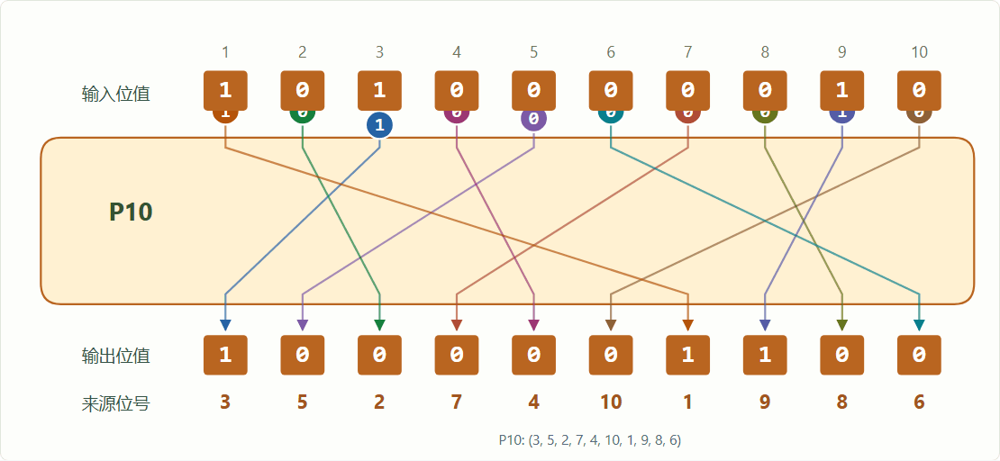

# S-DES · 信息安全实验台

信息安全导论课程作业：按课程给定置换表和修订版 S-box2，实现 8-bit 分组、10-bit 密钥的 S-DES，覆盖五关实验。中文 GUI 用位格、置换连线、S 盒表格与动画展示完整加解密过程；一个人也能在本地运行 A/B 双实现交叉实验。

**完成情况：本人已亲手完成第 1–5 关的个人模拟操作。** 由于没有保存当时的操作日志，另按现有材料整理了 [人工模拟过程记录](docs/manual-experiment-report.md)。该记录区分本人完成情况、复核用样例和程序验证证据；A/B 均由本人在本机模拟，其他同学没有参与。

**运行程序和算法测试仅需 Python 3.10+，无需安装第三方包。** GUI 使用本机浏览器，服务只监听 `127.0.0.1`，没有云端服务或账号。

```bash
python app.py
```

打开 **http://127.0.0.1:8765**。端口冲突时用 `python app.py --port 8766`；在终端按 `Ctrl+C` 退出。Windows 也可将 `python` 换成 `py -3`。



上方是界面录制的教学回放，不代表算法耗时。另见 [S 盒查表](docs/assets/08-sbox.png)、[轮函数图](docs/assets/10-round-function.png) 和 [个人 A/B 模拟](docs/assets/09-simulation.png)。

## 五关与证据

| 关卡 | 已实现能力 | 可检查的证据 |
| --- | --- | --- |
| 1 · 基本测试 | P10、循环移位、P8、IP、两轮 F/fₖ、SW、IP⁻¹ 的 SVG 图解与可控动画 | 固定向量、逐位轨迹、全部 262,144 个组合的独立实现对照与往返检查 |
| 2 · 交叉测试 | 个人 A/B 双实现仿真、双向传递动画、批量向量对照、JSON 导出/导入 | 本地 A 整数实现 / B 字符串实现实际计算；[交换向量](examples/exchange.json) |
| 3 · 扩展功能 | ASCII 按字节加解密、字符→分组→密文流程图 | 完整 ASCII 0–127、空串、换行及文本往返 |
| 4 · 暴力破解 | 穷举 1024 把密钥、候选收敛图、全部候选、真实计时 | [原始数据](reports/experiments.json)、[耗时动图](docs/assets/brute-force.gif) |
| 5 · 封闭测试 | 固定明文下的碰撞、分桶直方图、全明文穷举 | [256 个明文结果](reports/collisions.json)、鸽巢原理解释 |

小扩展是**候选密钥收敛**：示例每增加一对明密文，候选数从 `1024 → 4 → 2 → 1`。它使用第四关已有知识，能直观看出单对数据的歧义，没有引入额外密码算法。

第一关的过程图可以播放、暂停、前后单步、回到起点、调速和直接选择阶段。置换图显示课程规定的输入位置、实际 0/1 值与输出连线；S 盒图高亮行、列和查表结果。加密和解密分别按实际子密钥顺序展示，第二轮后直接进入 IP⁻¹。动画只用于讲解，计算结果与实验耗时来自真实算法执行。

## 快速核验

```bash
python -m unittest discover -v
python -m sdes encrypt 11010111 1010000010
python -m sdes decrypt 10001100 1010000010
python -m sdes trace 11010111 1010000010
python -m sdes verify examples/exchange.json
python -m sdes brute examples/known-pairs.txt
python -m sdes collision 00000000
```

固定向量：`P=11010111`、`K=1010000010`，得到 `C=10001100`；子密钥为 `K₁=10100100`、`K₂=01000011`。课程参数与部分网络教材不同，不能直接用其他版本的密文判错。第二次移位是在 LS-1 结果上继续 LS-2，详见[算法说明](docs/algorithm.md)。

## 文档导航

- [人工模拟过程记录](docs/manual-experiment-report.md)：本人完成五关后的过程回顾、代表性样例与分析。
- [用户指南](docs/user-guide.md)：五个页面的操作和常见错误。
- [开发手册与接口](docs/developer-guide.md)：模块划分、API、测试与扩展方式。
- [五关实验报告](docs/test-report.md)：实测数据、分析、证据范围。
- [个人模拟实测报告](docs/personal-simulation-report.md)：256 条 A/B 双向互测记录与完整加解密轨迹。
- [验证记录](docs/verification.md)：自动测试和浏览器验证的实际执行范围。

目录：`sdes/` 算法与服务，`web/` 界面，`tests/` 独立参考实现与测试，`examples/` 演示数据，`reports/` 程序实验结果，`docs/` 使用文档、实验报告与图示。运行与测试均不依赖本地证据制作工具。

## 实验与提交边界

本项目采用**个人完成、A/B 双实现本地仿真**的实验形式，A/B 是模拟角色。它能检查同一课程标准下的双向兼容性，未声称有真实小组、另一位作者或另一台设备参与。课程原要求为二人一组，个人仿真是否可替代组队及真人跨组环节由教师决定。

原始作业图片、私人记录、未脱敏材料和本地筹备工具均由 `.gitignore` 排除。仓库中的位串、密钥和截图仅用于教学演示，不包含内部提交表格或真实秘密。

S-DES 是教学算法，10 位密钥很容易穷举；逐字节模式还会暴露重复字符。不用于保护真实敏感数据。
