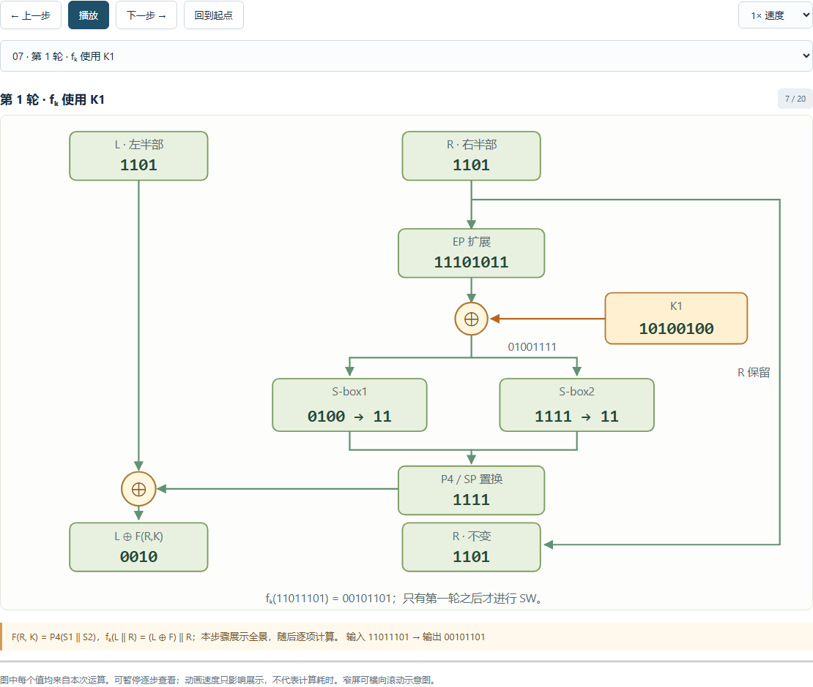
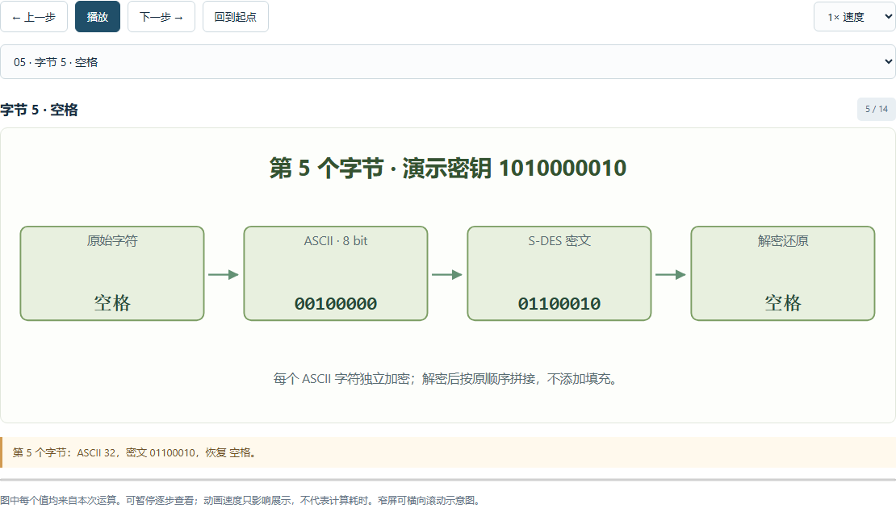

# S-DES 五关个人手动模拟实验报告

整理日期：2026-10-07

**本人已亲手完成第 1–5 关个人模拟；本记录事后根据操作回顾和现有程序材料整理。未保存操作当时的截图或日志；文中样例数值来自项目可复现数据，截图为程序验证、演示截图，不作为当时人工操作的逐步留证。A/B 由本人操作的本地模拟角色构成，没有其他同学参与。**

为便于复核，以下用项目已有样例重建操作顺序，不将每个样例输入、点击顺序或测量次数断言为当时人工操作的原样记录。本人完成情况与程序复核数据在文中分别说明；未记录的人工操作时间、试验次数和耗时不补写。原始计算结果见 [五关程序实验数据](../reports/experiments.json)、[A/B 模拟数据](../reports/personal-simulation.json) 和 [碰撞统计数据](../reports/collisions.json)。

## 实验目的与准备

本次实验以课程规定的 8 位分组、10 位密钥实现 S-DES。我通过图形界面完成加密、解密、个人交叉模拟、ASCII 扩展、已知明密文穷举和碰撞分析，并借助置换连线及轮函数动画观察中间结果。

程序按作业给定的 P10、P8、IP、IP⁻¹、EP、SPBox 和两个 S 盒运算。S-box2 使用作业修订表，第三行为 `(3, 0, 1, 2)`；密钥扩展中，左右各 5 位先循环左移 1 位得到 K₁ 的输入，再在该结果上继续左移 2 位得到 K₂ 的输入。具体参数及手工可核对的中间值见 [算法说明](algorithm.md)。

复现时，在安装 Python 3.10 或以上版本的计算机上，于仓库根目录运行：

```powershell
python app.py
```

然后打开 `http://127.0.0.1:8765`。五关共用一个中文界面，普通运行不需要第三方 Python 包。实验采用教学样例，不使用个人信息或真实敏感内容。

## 第 1 关：基本加解密及算法过程观察

**操作回顾与样例重建。** 我在第一关完成了分组加密和对应解密，并观察了算法的可视化过程。以下以项目默认样例重建这一操作：输入明文 `11010111`、密钥 `1010000010`，运行加密；播放过程图，在置换、S 盒和轮函数处暂停、单步查看；再将密文回填，切换解密方向，用相同密钥恢复明文。

项目保存的该样例结果为：

| 检查位置 | 可复核结果 |
| --- | --- |
| 密钥经 P10 | `1000001100` |
| 左右半部 LS-1 | `0000111000` |
| P8 得到 K₁ | `10100100` |
| 从 LS-1 结果继续 LS-2 | `0010000011` |
| P8 得到 K₂ | `01000011` |
| 明文经 IP | `11011101` |
| 第 1 轮输出 | `00101101` |
| SW 后 | `11010010` |
| 第 2 轮输出 | `01010010` |
| IP⁻¹ 后的密文 | `10001100` |
| 对该密文解密 | `11010111`，恢复原明文 |

我将图中的位号与位值分开理解：置换盒改变取位顺序，即使两位都为 `0`，也有各自的来源位置。EP 将右半部的 4 位扩展为 8 位，再与子密钥异或；S 盒用输入的外侧两位选行、内侧两位选列，各输出 2 位。两个 S 盒结果拼接后经 SPBox，再与左半部异或，右半部保留。

加密依次使用 K₁、K₂，解密依次使用 K₂、K₁。两轮之间进行一次 SW，第二轮结束后直接进入 IP⁻¹。界面中的轮函数全景与后续子步骤展示的是同一轮计算，不能把全景图多算成一轮。




置换的运动过程见 [P10 演示动图](assets/permutation-demo.gif)，S 盒的行列选择见 [查表截图](assets/08-sbox.png)。完整加密、解密各 20 步数值保存在 [个人模拟计算报告](personal-simulation-report.md)。

**本关认识。** 能够恢复原文是基本要求，过程可视化进一步帮助我检查取位、移位、S 盒选择及子密钥顺序是否符合课程约定。解密沿用同一结构并反转子密钥顺序，不需要求 S 盒的逆。

## 第 2 关：个人 A/B 交叉模拟

**操作回顾与样例重建。** 本关由我操作 A、B 两个模拟角色，完成同文同钥加密比较以及两个方向的解密验证。重建时为双方设置密钥 `1010000010`，输入若干 8 位明文并点击“运行 A/B 模拟”。先观察 A 加密、传递密文、B 解密的过程，再切换为 B 加密、A 解密，比较两端密文和还原值。对选中的明文可反复播放传递过程，并查看对应的批量对照行。

A 使用 `sdes.core` 的整数位运算实现，B 使用 `sdes.peer` 的独立字符串实现；B 不导入 A 的算法函数和置换常量。两端执行各自的计算后再比较结果。

以下三行摘自项目保存的 [A/B 原始记录](../reports/personal-simulation.json)，用于复核上述操作：

| 明文 | A 加密 | B 加密 | A→B 解密还原 | B→A 解密还原 |
| --- | --- | --- | --- | --- |
| `00000000` | `00001110` | `00001110` | `00000000` | `00000000` |
| `00000001` | `10000001` | `10000001` | `00000001` | `00000001` |
| `11010111` | `10001100` | `10001100` | `11010111` | `11010111` |

作为批量复核，项目还保存了固定该密钥时全部 256 个明文的计算结果：A/B 加密一致 **256/256**，A→B 解密还原 **256/256**，B→A 解密还原 **256/256**。这组数量来自已保存的程序运行材料，不表示本人曾逐条手工录入 256 个分组。


**本关认识。** 交叉测试需要双方使用同一算法约定，特别是修订后的 S-box2 和连续移位方式。两份实现对同一输入得到相同输出、并能相互解密，有助于发现实现差异。本关完成形式为单人、同一设备上的双实现本地模拟，动画表示本地的数据传递，没有跨设备网络传输。

## 第 3 关：ASCII 字符串扩展

**操作回顾与样例重建。** 我在第三关完成文本加密和密文回填解密，并通过字节流程图查看字符与分组的关系。以下用项目已有文本 `This is a test` 重建：输入文本和密钥 `1010000010`，运行加密，查看每个字符对应的 8 位分组、二进制密文与十六进制密文；再点击“密文回填解密”并运行，比较恢复文本。

该样例共 14 个 ASCII 字节，已有结果为：

```text
明文：This is a test
密钥：1010000010
十六进制密文：22 68 c7 27 62 c7 27 62 bd 62 4e f8 27 4e
解密还原：This is a test
```

流程图中的字符 `T` 对应分组 `01010100`，加密字节为 `00100010`，即十六进制 `22`。选择一个字节并展开其过程，可以回到第一关查看同样的置换与两轮运算，说明文本扩展复用了原来的 8 位分组算法。



**本关认识。** 密文字节可能不可打印，因此以十六进制传递更便于完整保留；显示乱码不应成为丢弃字节的理由。样例中重复的 `s` 均对应 `27`，空格均对应 `62`，反映出同一密钥下逐字节独立加密会暴露重复模式。程序限定 ASCII 输入，不将中文或 emoji 隐式截断。其他边界输入的覆盖情况见 [程序实验报告](test-report.md)。

## 第 4 关：已知明密文暴力破解

**操作回顾与样例重建。** 我在第四关完成已知明密文的穷举，查看候选密钥、搜索耗时和可视化结果。为复核候选变化，使用 [三对样例](../examples/known-pairs.txt)：先只保留第一对运行，再逐步加入后两对，每次观察结果。输入给破解功能的是明密文对，待寻找的密钥不作为搜索输入。

| 使用的已知记录 | 新增明文 | 新增密文 | 项目记录中的剩余候选数 |
| --- | --- | --- | --- |
| 尚未筛选 | — | — | 1024 |
| 第 1 对 | `00000000` | `00001110` | 4 |
| 前 2 对 | `00000001` | `10000001` | 2 |
| 全部 3 对 | `00001000` | `01110100` | 1 |

仅用第一对时，4 个候选为 `1000110110`、`1001111110`、`1010000010`、`1011001010`。使用全部三对后，唯一候选为 `1010000010`。候选收敛图将这一变化显示为 **1024 → 4 → 2 → 1**。


已有性能数据使用 `perf_counter_ns()` 计时，计入全部 1024 个密钥的检查和进度采样，不含网络与绘图。项目保存的九次三对搜索测量最小值为 **7.811 ms**、中位数为 **8.918 ms**、最大值为 **10.824 ms**；这些是程序实验材料中的测量值，不是本人当时人工操作的耗时记录。详细采样见 [experiments.json](../reports/experiments.json)，可观看 [采样回放动图](assets/brute-force.gif)。动画放慢了搜索过程，播放时长不等于算法耗时。

**本关认识。** 找到一个匹配密钥后仍须检查其余候选，单对明密文不一定能唯一确定密钥。增加有区分能力的已知信息可以缩小集合，但增加记录条数不一定增加信息量：项目的补充复核中，重复第一对得到 `[4, 4]`；选用另一条区分能力不足的第三对得到 `[4, 2, 2]`；矛盾的记录得到 0 个候选。不能据三对样例的成功便认为任何三对记录都能唯一破解。

## 第 5 关：封闭测试与密钥碰撞

**操作回顾与样例重建。** 我在第五关完成固定明文下的密钥碰撞统计，并查看同一密文对应的多个密钥。为了把第四关的“多个候选”与第五关联系起来，以下先引用项目已有的随机抽样样例，再用固定明文 `00000000` 重建统计与复核步骤。

项目保存的抽样实验使用固定种子以便复现，样例为 `P=10001101`、`K=1001011110`、`C=10110110`。只依据这对明密文搜索得到 4 个候选：`0110011011`、`0111010011`、`1001011110`、`1010010001`。该抽样数据来自程序记录，不补称为当时本人手动随机选取的原始输入。

在第五关输入 `00000000`，点击“统计密钥碰撞”，查看统计卡片、分桶直方图及碰撞实例。项目对应结果如下：

| 统计项目 | 可复核结果 |
| --- | --- |
| 遍历密钥数 | 1024 |
| 不同密文数 | 240 |
| 至少对应两个密钥的密文组数 | 224 |
| 仅对应一个密钥的密文组数 | 16 |
| 单个密文对应的最多密钥数 | 12 |

例如，对明文 `00000000`，不同密钥 `0000000111` 和 `0001001111` 都得到密文 `00000000`。将这两个组合分别填入第一关即可复核；原始数据保留了该组全部 8 把密钥。


项目还对全部 **256 个明文 × 1024 个密钥** 进行了程序枚举。每个明文都存在至少一组密钥碰撞，各明文对应的不同密文数在 **238–240** 之间；完整逐项数据见 [collisions.json](../reports/collisions.json)。这属于程序全量验证，不计为本人逐项手算。

**本关认识。** 固定明文后，1024 把密钥映射到至多 256 个密文，依据鸽巢原理一定存在至少两把密钥得到相同密文。但这不代表每一对给定明密文都对应多把密钥，也不代表这些密钥对其他所有明文都等价。固定密钥改变明文时，加密仍是 256 个分组上的可逆排列；它与固定明文改变密钥时的碰撞是两个不同问题。

## 实验收获与材料索引

本人已完成五关的个人手动模拟。通过置换盒连线、S 盒行列高亮、两轮函数图及双向传递动画，我能够把输入输出结果与内部步骤联系起来。适度扩展集中在“候选密钥收敛”上：它沿用课程中的穷举方法，将不同已知信息对候选集合的影响显示出来，便于解释单对信息为何可能不足。

本报告记录个人完成情况并整理复核路径；用于检查数值与程序正确性的配套材料如下：

| 材料 | 用途 |
| --- | --- |
| [用户指南](user-guide.md) | 重新运行五关界面、动画和文件交换 |
| [算法说明](algorithm.md) | 核对课程参数、子密钥与逐轮结果 |
| [五关程序实验报告](test-report.md) | 查阅可复现结果、计时方法及碰撞分析 |
| [个人 A/B 模拟计算报告](personal-simulation-report.md) | 查阅 256 条双向核验和完整加解密轨迹 |
| [验证执行记录](verification.md) | 查阅独立实现对照、自动测试及 GUI 检查范围 |

S-DES 的 10 位密钥空间很小，文本逐字节模式还会暴露重复信息。本实验用于理解分组密码结构、互操作验证及穷举分析，不将其用于实际敏感数据保护。
