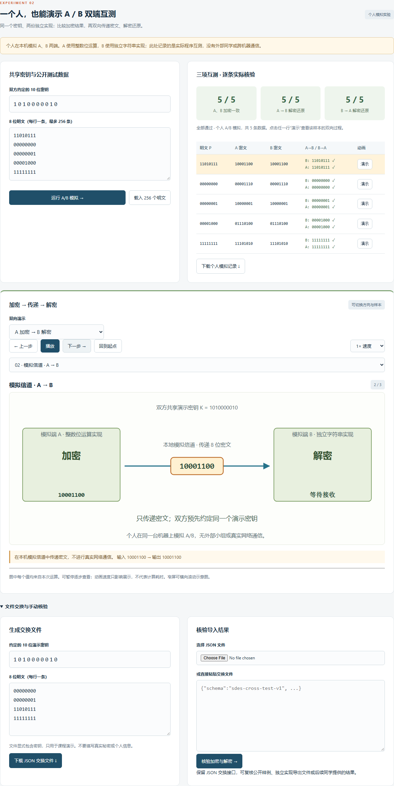
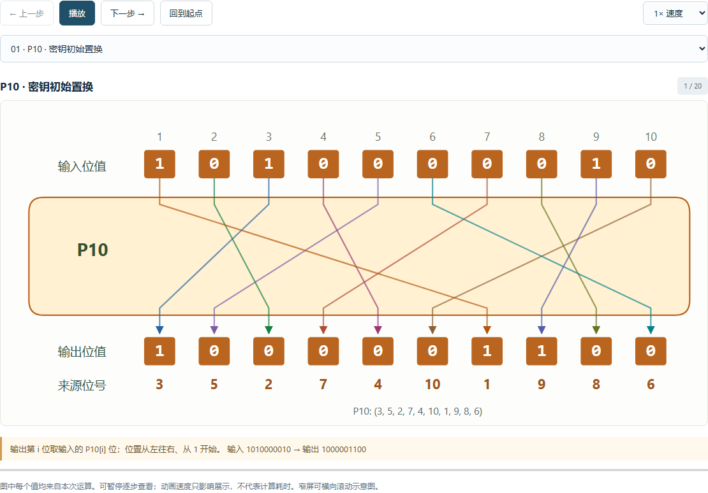
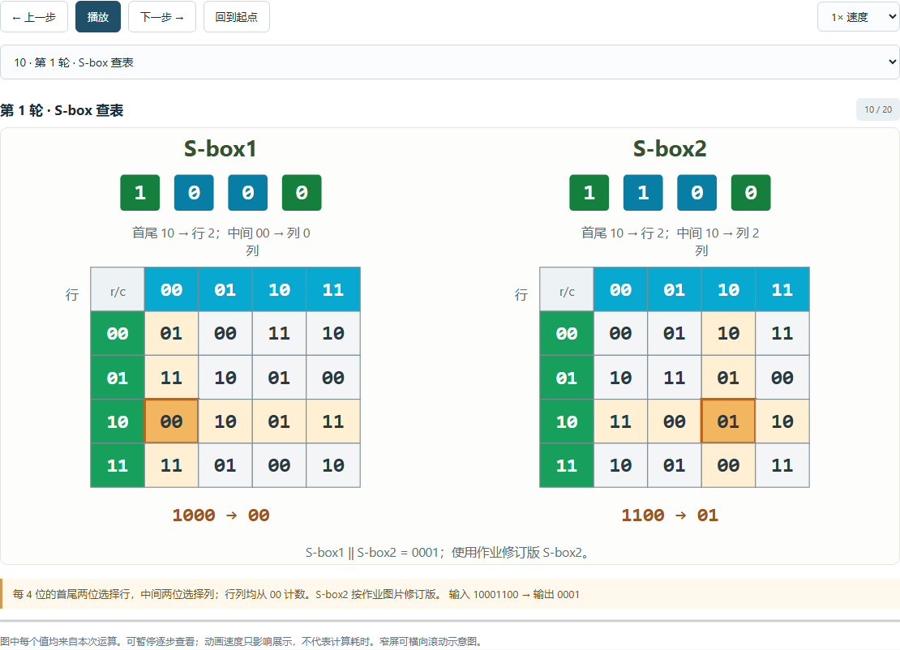

# 个人模拟与可视化实验记录

本报告由 `python scripts/generate_simulation_report.py` 根据实际计算结果生成。原始数据见 [personal-simulation.json](../reports/personal-simulation.json)，可下载后复算。数据只含教学密钥、位串和算法信息，不记录姓名、邮箱、主机名或本地绝对路径。

本次采用**个人 A/B 双实现模拟**：A 端调用 `sdes.core` 的整数位运算实现，B 端调用 `sdes.peer` 的独立字符串实现。B 端未导入 A 端算法函数或置换常量。两端在本机运行，模拟密文传递；没有外部小组参与，没有实际网络传输，不构成异构平台实测。

## 五关个人演示安排

| 关卡 | 个人演示内容 | 结果出处 |
| --- | --- | --- |
| 第 1 关：基本测试 | 输入明文 / 密文和密钥，逐步展示置换盒、轮函数、S-box 与解密逆序子密钥 | 本报告重新生成加密、解密各 20 步真实值 |
| 第 2 关：交叉测试 | 同一密钥下分别运行 A/B 加密，再执行 A→B 与 B→A 解密核对 | 本报告重新计算全部 256 个明文 |
| 第 3 关：ASCII 扩展 | 演示文本逐字节编码、加密和还原，可观察重复字符对应重复密文字节 | [五关实验报告](test-report.md#第-3-关ascii-扩展) |
| 第 4 关：暴力破解 | 已知明密文对筛选全部 1024 个候选，观察候选收敛和实测时间曲线 | [五关实验报告](test-report.md#第-4-关暴力破解与候选收敛) |
| 第 5 关：封闭测试 | 固定明文改变密钥，查看同密文碰撞组并解释多对明密文的作用 | [五关实验报告](test-report.md#第-5-关封闭测试) |

本次生成脚本只重新执行前两关涉及的模拟与轨迹计算。第 3–5 关沿用所链接报告的独立实验数据；完整自动测试和浏览器验证另见 [验证记录](verification.md)。不能把本报告生成成功等同于通过全部测试，也不能把个人模拟写成真人跨组实验。

## 第 2 关：256 条明文的真实模拟结果

共享演示密钥为 `1010000010`，明文依次取 `00000000` 到 `11111111`。这覆盖该固定密钥的全部 256 个明文，不表示此次运行已覆盖所有 1024 个密钥。

| 检查项目 | 通过数 / 总数 | 判定方式 |
| --- | --- | --- |
| A/B 同文同钥加密一致 | 256 / 256 | `A.encrypt(P, K) == B.encrypt(P, K)` |
| A 加密 → B 解密 | 256 / 256 | `B.decrypt(A.encrypt(P, K), K) == P` |
| B 加密 → A 解密 | 256 / 256 | `A.decrypt(B.encrypt(P, K), K) == P` |

三类检查全部通过。原始 JSON 的 `simulation_result.rows` 保留每条明文、两端密文、两端交叉解密结果和三个判定值，而非只保留总计。GUI 可观察 A/B 节点间的加密、模拟信道、解密三段动画；相同明密文还可在第 1 关查看逐步加解密图示。



## 第 1 关：加解密各 20 步图示数据

默认演示输入：`P=11010111`、`K=1010000010`，得到 `C=10001100`；反向输入该密文，还原为 `P=11010111`。子密钥为 `K1=10100100`、`K2=01000011`。

图示采用作业中的 P10、P8、IP、IP⁻¹、EP、SPBox/P4 与两个 S-box。LS-1、LS-2 均在 5 位左右半部分别循环；LS-2 在 LS-1 后继续左移两位。S-box2 使用作业图片修订表 `[(0,1,2,3),(2,3,1,0),(3,0,1,2),(2,1,0,3)]`。加密先 K1 后 K2，解密先 K2 后 K1；只在两轮之间交换一次。

每个轮函数全景是后续子步骤的计算预览，不是额外执行的一轮。下表中的异或输出可能只有 4 位，右半部分保留并拼接的 8 位结果一并注明。完整 JSON 另保留连线位置映射和 S-box 行列及查表值。





### 加密：K1 → K2

| 步骤 | 操作 | 实际输入 | 实际输出 |
| --- | --- | --- | --- |
| 1 | P10 · 密钥初始置换 | `1010000010` | `1000001100` |
| 2 | LS-1 · 两半分别循环左移 1 位 | `1000001100` | `0000111000` |
| 3 | P8 · 生成 K1 | `0000111000` | `10100100` |
| 4 | LS-2 · 在 LS-1 结果上继续左移 2 位 | `0000111000` | `0010000011` |
| 5 | P8 · 生成 K2 | `0010000011` | `01000011` |
| 6 | IP · 分组初始置换 | `11010111` | `11011101` |
| 7 | 第 1 轮 · fₖ 使用 K1 | `11011101` | `00101101` |
| 8 | 第 1 轮 · EP 扩展置换 | `1101` | `11101011` |
| 9 | 第 1 轮 · 与 K1 异或 | `11101011 ⊕ 10100100` | `01001111` |
| 10 | 第 1 轮 · S-box 查表 | `01001111` | `1111` |
| 11 | 第 1 轮 · P4 / SPBox | `1111` | `1111` |
| 12 | 第 1 轮 · 左半异或与拼接 | `1101 ⊕ 1111` | `0010`；保留右半后 `00101101` |
| 13 | SW · 交换左右两半 | `00101101` | `11010010` |
| 14 | 第 2 轮 · fₖ 使用 K2 | `11010010` | `01010010` |
| 15 | 第 2 轮 · EP 扩展置换 | `0010` | `00010100` |
| 16 | 第 2 轮 · 与 K2 异或 | `00010100 ⊕ 01000011` | `01010111` |
| 17 | 第 2 轮 · S-box 查表 | `01010111` | `0100` |
| 18 | 第 2 轮 · P4 / SPBox | `0100` | `1000` |
| 19 | 第 2 轮 · 左半异或与拼接 | `1101 ⊕ 1000` | `0101`；保留右半后 `01010010` |
| 20 | IP⁻¹ · 最终逆置换 | `01010010` | `10001100` |

### 解密：K2 → K1

| 步骤 | 操作 | 实际输入 | 实际输出 |
| --- | --- | --- | --- |
| 1 | P10 · 密钥初始置换 | `1010000010` | `1000001100` |
| 2 | LS-1 · 两半分别循环左移 1 位 | `1000001100` | `0000111000` |
| 3 | P8 · 生成 K1 | `0000111000` | `10100100` |
| 4 | LS-2 · 在 LS-1 结果上继续左移 2 位 | `0000111000` | `0010000011` |
| 5 | P8 · 生成 K2 | `0010000011` | `01000011` |
| 6 | IP · 分组初始置换 | `10001100` | `01010010` |
| 7 | 第 1 轮 · fₖ 使用 K2 | `01010010` | `11010010` |
| 8 | 第 1 轮 · EP 扩展置换 | `0010` | `00010100` |
| 9 | 第 1 轮 · 与 K2 异或 | `00010100 ⊕ 01000011` | `01010111` |
| 10 | 第 1 轮 · S-box 查表 | `01010111` | `0100` |
| 11 | 第 1 轮 · P4 / SPBox | `0100` | `1000` |
| 12 | 第 1 轮 · 左半异或与拼接 | `0101 ⊕ 1000` | `1101`；保留右半后 `11010010` |
| 13 | SW · 交换左右两半 | `11010010` | `00101101` |
| 14 | 第 2 轮 · fₖ 使用 K1 | `00101101` | `11011101` |
| 15 | 第 2 轮 · EP 扩展置换 | `1101` | `11101011` |
| 16 | 第 2 轮 · 与 K1 异或 | `11101011 ⊕ 10100100` | `01001111` |
| 17 | 第 2 轮 · S-box 查表 | `01001111` | `1111` |
| 18 | 第 2 轮 · P4 / SPBox | `1111` | `1111` |
| 19 | 第 2 轮 · 左半异或与拼接 | `0010 ⊕ 1111` | `1101`；保留右半后 `11011101` |
| 20 | IP⁻¹ · 最终逆置换 | `11011101` | `11010111` |

## 回放与计时的区别

置换连线、S-box 高亮、轮函数路径和 A/B 节点动画是对实际计算结果的教学回放。播放速度、暂停、单步与来回切换只影响观看过程，**动画播放时长不是加解密耗时，也不是暴力破解耗时**。本报告不把动画时长记作性能结果；暴力破解的真实计时方法及原始采样见 [五关实验报告](test-report.md#时间测量)。

复现本报告：

```powershell
python scripts/generate_simulation_report.py
```

脚本将重新写入本 Markdown 和 [原始 JSON](../reports/personal-simulation.json)，并核对自身生成的 256 条双向模拟结果与默认演示的 20 步轨迹结果；截图由实际 GUI 验证过程另外生成。
