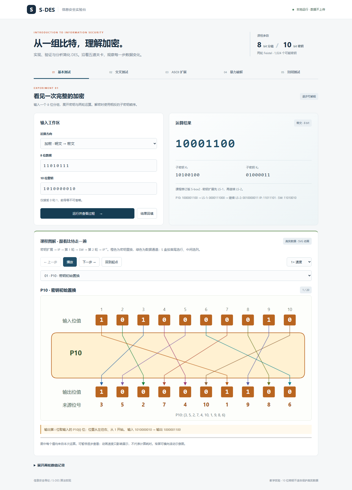
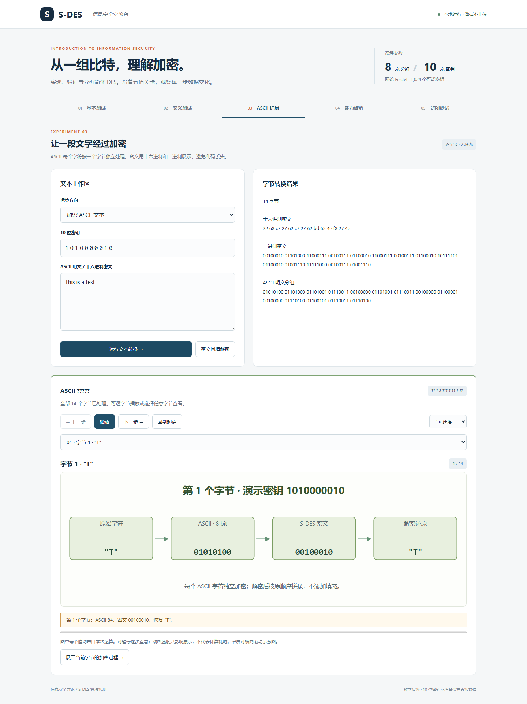
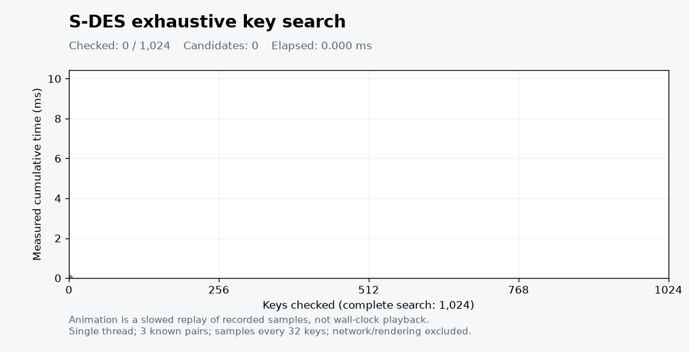
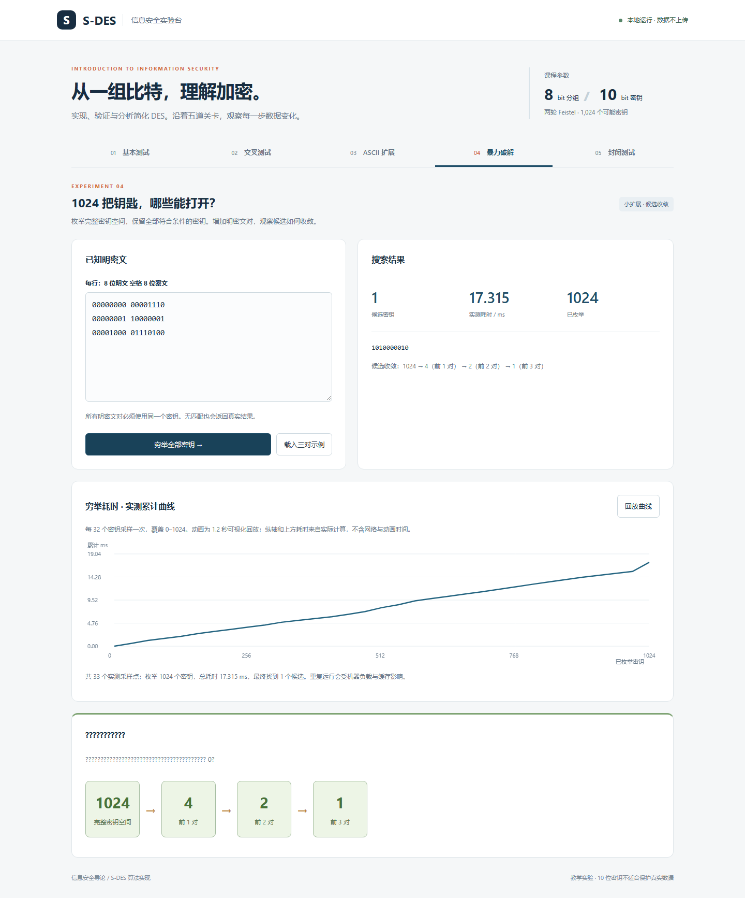
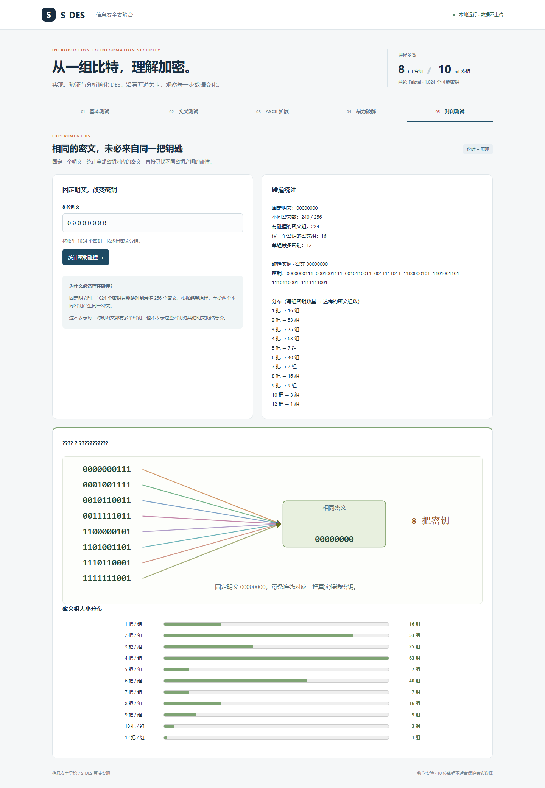

# 五关实验报告

本文件由 `scripts/generate_report.py` 根据本机真实运行结果生成。原始 JSON 可复算；运行时间随硬件、负载、缓存变化，不作为固定性能承诺。环境：Python 3.12.7 / Windows。不记录用户名、主机名或本地绝对路径。

## 第 1 关：基本测试

`P=11010111, K=1010000010 → C=10001100 → P=11010111`。K₁ 为 `10100100`，K₂ 为 `01000011`。手工逐轮值见 [算法说明](algorithm.md)，完整轨迹见 [原始数据](../reports/experiments.json)。

`python -m unittest discover -v` 覆盖全部 **1024 × 256 = 262,144** 个组合：生产整数实现与独立字符串实现逐项核对，每项再解密还原；对每个固定密钥确认 256 个输出均不重复。自动测试执行记录见 [验证记录](verification.md)，不把生成本报告当作运行了全部测试。



新版 GUI 提供 20 步课程图解，可播放 / 暂停 / 单步 / 调速。P10、LS、P8、IP、EP、P4、SW、IP⁻¹ 均显示输入位号与来源连线；S 盒呈现完整表格和选中行列；两轮按实际子密钥顺序展开。[置换盒截图](assets/07-permutation.png)、[S 盒截图](assets/08-sbox.png)、[轮函数截图](assets/10-round-function.png)。

## 第 2 关：个人 A/B 双实现模拟

A 端调用整数位运算实现，B 端调用独立字符串实现。固定密钥 `1010000010`，实际检查全部 256 个明文：加密一致 256/256，A→B 解密还原 256/256，B→A 解密还原 256/256。界面可选任意记录，播放加密、传递、解密，并下载完整记录。

这是个人在同一台设备上的模拟实验，两个算法确实分别执行；没有虚构外部同学、跨平台环境或网络传输。[个人模拟报告](personal-simulation-report.md) 与 [256 条原始记录](../reports/personal-simulation.json) 可复核完整数据。


文件交换接口也保留：6 条演示向量自检双向通过，并提供 [256 条完整交换文件](../examples/full-byte-exchange.json)。

## 第 3 关：ASCII 扩展

明文 `This is a test`，共 14 字节，密钥 `1010000010`。

```text
十六进制密文：22 68 c7 27 62 c7 27 62 bd 62 4e f8 27 4e
解密还原：This is a test
```

ASCII 0–127、空串、换行、Tab、NUL 的往返由自动测试覆盖；中文、emoji 和非法十六进制被拒绝。密文按字节保留，避免乱码复制导致丢失。相同字符产生相同密文字节，说明当前逐字节模式会暴露重复模式。



## 第 4 关：暴力破解与候选收敛

输入不包含待找密钥，只提供以下已知明密文；每次遍历完整 1024 个候选。示例真实密钥为 `1010000010`。

| 新增记录 | 明文 | 密文 | 使用此前全部记录后的候选数 |
| --- | --- | --- | --- |
| 1 | `00000000` | `00001110` | 4 |
| 2 | `00000001` | `10000001` | 2 |
| 3 | `00001000` | `01110100` | 1 |

仅第一对得到 4 个候选：`1000110110`, `1001111110`, `1010000010`, `1011001010`。三对后为 1 个：`1010000010`。不能把第一次命中直接当成唯一密钥。

重复第一对两次，候选为 `[4, 4]`；将第三对改成明文 `11010111` 的对应记录，候选为 `[4, 2, 2]`；输入同一明文对应两种不同密文，得到 0 个候选。这些反例说明信息量与记录条数并不相同。

### 时间测量

计时器 `perf_counter_ns()`；单线程。计入全部候选搜索与每 32 个密钥的采样成本，不含输入解析、网络和绘图。先执行单对与三对搜索，再重复九次；子密钥缓存已预热。完整九次原始采样均保留，不只选择最快一次。

| 轮次 | 耗时 / ms |
| --- | --- |
| 1 | 10.824000 |
| 2 | 10.393300 |
| 3 | 7.811000 |
| 4 | 9.498000 |
| 5 | 8.917900 |
| 6 | 8.294900 |
| 7 | 9.066800 |
| 8 | 8.916900 |
| 9 | 8.139900 |

最小 **7.811 ms**，中位数 **8.918 ms**，最大 **10.824 ms**。下方动图使用首次三对搜索的 33 个累计采样点，该次总耗时为 **9.222 ms**。图末点对应第 1024 个密钥采样，总耗时还包含函数末尾的少量收尾工作。



**动图是放慢的采样回放，播放时长不代表破解耗时。** 没有伪造等待或声称多线程提速。另有 [静态曲线](assets/brute-force.png) 和 [完整 JSON](../reports/experiments.json)。GUI 中也提供同类实测曲线。



## 第 5 关：封闭测试

先用固定种子 `20261005` 的伪随机数生成器抽取明文与密钥，以便其他人重复本实验：`P=10001101`、`K=1001011110`，加密得到 `C=10110110`。只把这对 P/C 交给穷举程序，找到 **4** 个候选：`0110011011`, `0111010011`, `1001011110`, `1010010001`。此处随机用于抽样教学数据，不用于生成安全密钥。

固定明文 `00000000`，遍历全部密钥，得到：

- 不同密文 240 个；有多个密钥的密文组 224 个。
- 仅一个密钥的密文组 16 个；单个密文对应最多 12 个密钥。
- 实例：密钥 `0000000111`, `0001001111`, `0010110011`, `0011111011`, `1100000101`, `1101001101`, `1110110001`, `1111111001` 对该明文均得到密文 `00000000`。

遍历全体 **256 个明文 × 1024 个密钥**，256 个明文都至少存在一组碰撞；每个明文能够产生的不同密文数介于 **238–240**。逐明文统计和直方图见 [collisions.json](../reports/collisions.json)。

**解释：** 对任意固定明文，函数 `K → E_K(P)` 将 1024 个密钥映射到至多 256 个密文。鸽巢原理保证至少两个密钥映射到同一个密文。它不意味着任意给定明密文对都对应多个密钥，也不意味着这些密钥对所有其他明文等价。固定密钥下的加密仍是双射，与固定明文改变密钥的碰撞不矛盾。



## 已知限制与提交状态

- 课程参数中的连续移位解释已显式写出，互测时应与课堂约定核对。
- 当前提交形式为个人 A/B 双实现本地模拟，未声称真人跨组或异构设备测试。
- 当前不是互联网部署，也没有 TCP 扩展；选做小想法保持在候选筛选和可视化层面。
- 本报告只用于教学，不能据此宣称 S-DES 具有实际安全性或保证成绩。
